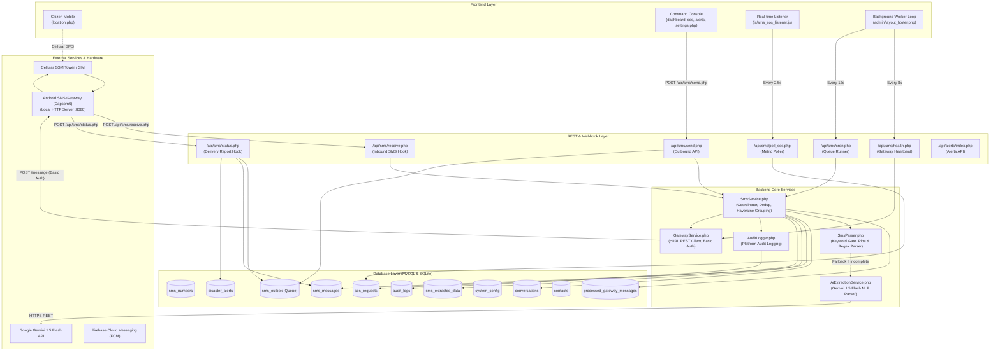
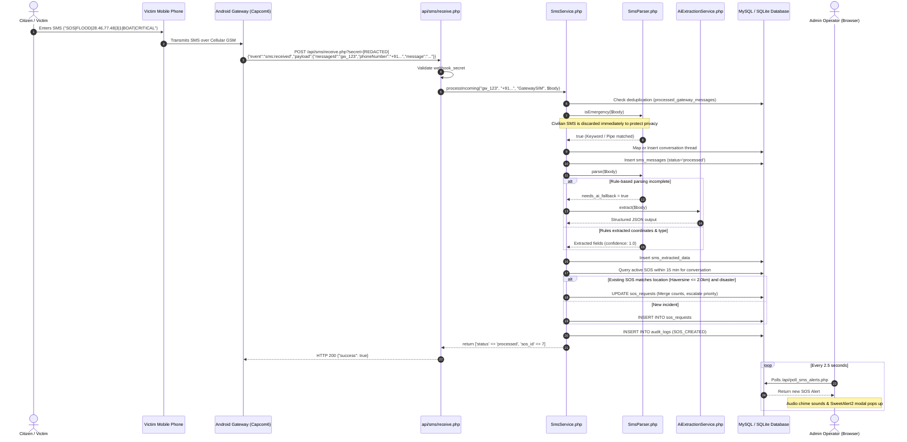
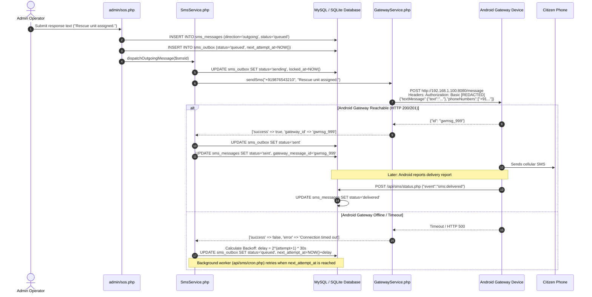
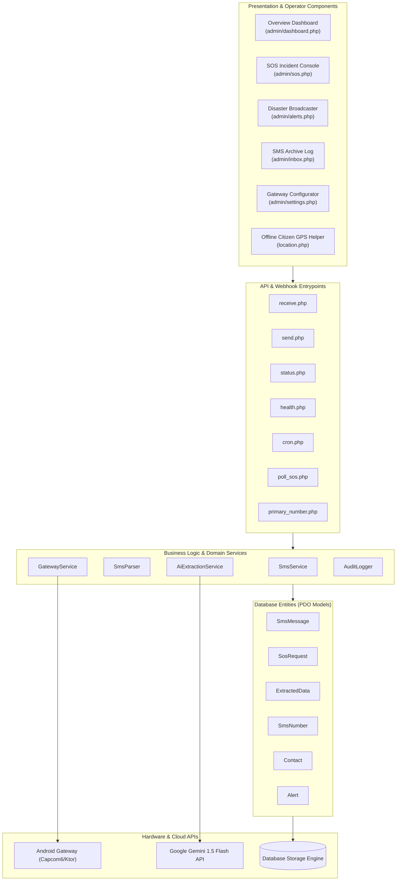
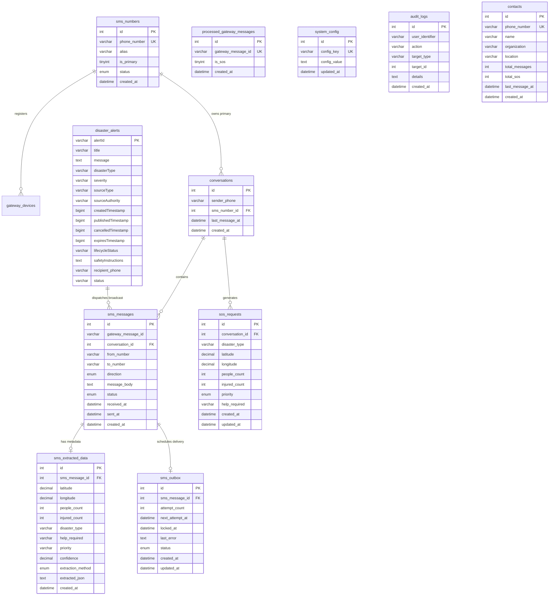

# 🛰️ DisasterSafe / GeoGuardians2 - SMS Gateway Architecture & System Design

> **Official Technical Specification & Engineering Documentation**  
> *Base Codepath: `c:\wamp64\www\GeoGuardians2`*  
> *Target Subsystem: `Application/SMS_PART2` & Root Gateway Integrations*  

---

## 1. PROJECT STRUCTURE

The following tree represents the exact file and folder structure directly supporting the SMS Gateway subsystem:

```text
c:/wamp64/www/GeoGuardians2/
├── gateway_sms.php                                     # Root Superadmin SMS Gateway Command Hub
├── footer.php                                          # Includes global real-time SMS listener script
├── js/
│   └── sms_sos_listener.js                             # Real-time background audio chime & SweetAlert2 popup listener
├── api/
│   └── poll_sms_alerts.php                             # Real-time polling API for root portal notifications
└── Application/
    └── SMS_PART2/
        ├── location.php                                # Offline Citizen HTML5 GPS -> SMS Builder
        ├── scratch_db.php                              # CLI diagnostics & database validation script
        ├── config/
        │   ├── credentials.php                         # Core credentials store (DB, Gateway, Gemini API)
        │   ├── gateway.php                             # Gateway configuration accessor wrapper
        │   ├── database.php                            # Singleton PDO MySQL database connection
        │   └── gemini.php                              # Gemini API configuration accessor wrapper
        ├── database/
        │   ├── schema.sql                              # MySQL DDL (11 core relational tables)
        │   ├── create_alerts_table.php                 # Dynamic table generator for disaster_alerts
        │   ├── seed_alerts.php                         # Seed script for initial alerts
        │   └── sms_gateway.sqlite                      # Local SQLite instance for standalone mode
        ├── models/
        │   ├── SmsMessage.php                          # SMS record CRUD, status tracking, outbox queueing
        │   ├── SosRequest.php                          # Emergency incident model & priority manager
        │   ├── ExtractedData.php                       # Metadata model for NLP / AI parsed fields
        │   ├── SmsNumber.php                           # Registered Gateway SIM phone numbers manager
        │   ├── Contact.php                             # Citizen & responder address book registry
        │   └── Alert.php                               # Multi-channel disaster hazard alert model
        ├── services/
        │   ├── GatewayService.php                      # HTTP client talking to Capcom6 Android SMS Gateway
        │   ├── SmsService.php                          # Core orchestrator (dedup, group, outbox, triage)
        │   ├── SmsParser.php                           # Regex, pipe-delimited parser & coordinate extractor
        │   ├── AiExtractionService.php                 # Gemini 1.5 Flash natural language disaster extractor
        │   └── AuditLogger.php                         # Structured event logging to audit_logs
        ├── api/
        │   ├── sms/
        │   │   ├── receive.php                         # Public webhook receiver from Android Gateway
        │   │   ├── send.php                            # Local API to enqueue & dispatch outbound SMS
        │   │   ├── status.php                          # Public webhook callback for delivery reports
        │   │   ├── health.php                          # Gateway connectivity, ping & auth diagnostics
        │   │   ├── poll_sos.php                        # Poll endpoint for SOS incident metrics
        │   │   ├── cron.php                            # Scheduled worker runner for outbox retry queue
        │   │   └── primary_number.php                  # Endpoint returning central active SIM number
        │   ├── alerts/
        │   │   └── index.php                           # REST API for active/recent disaster alerts
        │   └── devices/
        │       └── token.php                           # FCM device token registration endpoint
        └── admin/
            ├── layout_header.php                       # Command console navigation & telemetry badge
            ├── layout_footer.php                       # Auto-refresh queue worker (12s) & health poller (8s)
            ├── dashboard.php                           # Live Leaflet Map & KPI Overview
            ├── sos.php                                 # Interactive Emergency Triage & Two-Way Chat
            ├── inbox.php                               # SMS communication logs archive
            ├── contacts.php                            # Emergency registry management
            ├── alerts.php                              # Disaster Alert publisher & SMS broadcaster
            ├── send_message.php                        # Direct outbound SMS dispatcher
            └── settings.php                            # Gateway endpoint URL & SIM configuration
```

---

## 2. COMPONENT IDENTIFICATION

| Layer | File / Subsystem | Technology | Responsibility |
| :--- | :--- | :--- | :--- |
| **[Frontend]** | `location.php` | HTML5 Geolocation, Vanilla JS, CSS3 | Offline GPS capture & `sms:` URI generation |
| **[Frontend]** | `admin/dashboard.php`, `sos.php`, `alerts.php`, `settings.php` | Vanilla PHP, HTML5, Leaflet.js, CSS Grid | Operational triage views, tactical GIS map, chat thread, settings |
| **[Frontend]** | `js/sms_sos_listener.js` | JS Web Audio API, SweetAlert2, Fetch API | Background real-time audio and modal alert monitor |
| **[Frontend]** | `admin/layout_footer.php` | Vanilla JS `setInterval` | Heartbeat polling (8s) & Outbox queue execution (12s) |
| **[Backend API]** | `api/sms/receive.php` | PHP Native JSON API | Webhook receiver for cellular inbound SMS |
| **[Backend API]** | `api/sms/send.php` | PHP Native JSON API | Outbound SMS dispatch & enqueue endpoint |
| **[Backend API]** | `api/sms/status.php` | PHP Native JSON API | Webhook delivery report callback receiver |
| **[Backend API]** | `api/sms/health.php` | PHP cURL | Asynchronous gateway connectivity & auth tester |
| **[Backend API]** | `api/sms/poll_sos.php` | PHP Native JSON API | Real-time SOS incident count and change detector |
| **[Backend API]** | `api/sms/cron.php` | PHP Native JSON API | Scheduled worker runner trigger for outbound queue retry |
| **[Backend Services]** | `services/SmsService.php` | PHP Class (Static Methods) | Central coordinator, deduplication, Haversine grouping |
| **[Backend Services]** | `services/GatewayService.php` | PHP cURL, HTTP Basic Auth | Android SMS Gateway REST communication |
| **[Backend Services]** | `services/SmsParser.php` | PHP Regular Expressions | Emergency keyword gatekeeper, syntax & coordinate parser |
| **[Backend Services]** | `services/AiExtractionService.php` | PHP cURL, Google Gemini REST API | NLP extraction fallback using LLM JSON schema |
| **[Backend Services]** | `services/AuditLogger.php` | PHP PDO | Structured platform audit logging |
| **[Database Models]** | `models/SmsMessage.php`, `SosRequest.php`, `ExtractedData.php`, `SmsNumber.php`, `Contact.php`, `Alert.php` | PHP Data Access Objects (PDO) | CRUD operations, query builders, and database entity wrappers |
| **[Database]** | MySQL Database (`sms_sos_gateway`) & SQLite (`sms_gateway.sqlite`) | MySQL 8.x / SQLite 3 | Relational tables for SIMs, messages, queues, incidents, logs |
| **[External Service]** | Android SMS Gateway (Capcom6 App) | Kotlin Ktor HTTP Server (`:8080`) | Hardware cellular modem bridging HTTP and GSM network |
| **[External Service]** | Google Gemini API (`gemini-1.5-flash`) | HTTPS REST API | Natural language understanding for emergency SMS parsing |
| **[External Service]** | Firebase Cloud Messaging (FCM) | Google FCM HTTP v1 / Legacy | Mobile push notification fan-out for disaster alerts |

---

## 3. FILE-TO-FILE CONNECTION MAP

```text
1. [Citizen Mobile]
   ↓ sends cellular SMS over GSM
   [Android Gateway Device (Capcom6 App)]
   ↓ HTTP POST (JSON Webhook + secret)
   [Application/SMS_PART2/api/sms/receive.php]
   ↓ validates secret & calls
   [Application/SMS_PART2/services/SmsService.php::processIncoming()]
   ├── calls → [Application/SMS_PART2/models/SmsMessage.php::isDuplicate()]
   │             ↓ queries
   │             [DB: processed_gateway_messages]
   ├── calls → [Application/SMS_PART2/services/SmsParser.php::isEmergency()]
   ├── calls → [Application/SMS_PART2/models/SmsMessage.php::create()]
   │             ↓ inserts
   │             [DB: sms_messages]
   ├── calls → [Application/SMS_PART2/services/SmsParser.php::parse()]
   ├── calls (conditional fallback) → [Application/SMS_PART2/services/AiExtractionService.php::extract()]
   │                                     ↓ HTTPS POST
   │                                     [External: Google Gemini API]
   ├── calls → [Application/SMS_PART2/models/ExtractedData.php::create()]
   │             ↓ inserts
   │             [DB: sms_extracted_data]
   ├── calls → [Application/SMS_PART2/services/SmsService.php::calculateHaversineDistance()]
   ├── calls → [Application/SMS_PART2/models/SosRequest.php::create() or updateIncident()]
   │             ↓ writes
   │             [DB: sos_requests]
   └── calls → [Application/SMS_PART2/services/AuditLogger.php::log()]
                 ↓ inserts
                 [DB: audit_logs]

2. [Admin Console: send_message.php / sos.php / alerts.php]
   ↓ HTTP POST / Internal Function Call
   [Application/SMS_PART2/api/sms/send.php] (or alerts.php:sendSmsBroadcast())
   ↓ invokes
   [Application/SMS_PART2/models/SmsMessage.php::create()]
   ↓ writes
   [DB: sms_messages (status='queued')]
   ↓ invokes
   [Application/SMS_PART2/models/SmsMessage.php::enqueueOutbox()]
   ↓ writes
   [DB: sms_outbox (status='queued')]
   ↓ invokes
   [Application/SMS_PART2/services/SmsService.php::dispatchOutgoingMessage()]
   ↓ updates
   [DB: sms_outbox (status='sending', locked_at=NOW())]
   ↓ calls
   [Application/SMS_PART2/services/GatewayService.php::sendSms()]
   ↓ HTTP POST (JSON + Basic Auth)
   [Android Gateway Device: http://<ip>:8080/message]
   ↓ transmits via cellular SIM
   [Recipient Citizen Mobile]

3. [Android Gateway Device]
   ↓ HTTP POST (Delivery callback + secret)
   [Application/SMS_PART2/api/sms/status.php]
   ↓ invokes
   [Application/SMS_PART2/models/SmsMessage.php::updateStatus()]
   ↓ updates
   [DB: sms_messages (status='delivered' | 'failed')]
   ↓ invokes
   [Application/SMS_PART2/services/SmsService.php::syncAlertStatusFromMessage()]
   ↓ updates
   [DB: disaster_alerts (status='sent' | 'partial' | 'failed')]

4. [Browser: admin/layout_footer.php]
   ├── (Every 8s) AJAX GET → [Application/SMS_PART2/api/sms/health.php]
   │                          ↓ cURL ping + Basic Auth
   │                          [Android Gateway: http://<ip>:8080/]
   └── (Every 12s) AJAX GET → [Application/SMS_PART2/api/sms/cron.php]
                              ↓ invokes
                              [Application/SMS_PART2/services/SmsService.php::processOutboxQueue()]
                              ↓ queries unlocked & due retry items
                              [DB: sms_outbox]
```

---

## 4. SMS REQUEST LIFECYCLE (END-TO-END FLOW)

### Inbound Distress Flow
1. **Offline Capture**: Citizen triggers `location.php`, which reads GPS coordinates and builds `SOS|FLOOD|28.4608,77.4890|4|1|BOAT RESCUE|CRITICAL`.
2. **Cellular Broadcast**: Transmitted via standard GSM cellular carrier to the command center SIM card.
3. **Android Ingestion**: Capcom6 Android app intercepts SMS and sends an HTTP POST webhook to `/api/sms/receive.php?secret=[REDACTED]`.
4. **Secret Authentication**: Webhook verifies token matching `credentials.php` (`webhook_secret`).
5. **Deduplication Check**: Verifies `gateway_message_id` has not already been processed in `processed_gateway_messages`.
6. **Civilian Privacy Gate**: Evaluates `SmsParser::isEmergency()`. Personal non-emergency SMS are discarded without saving body.
7. **Thread Binding**: Finds or registers conversation thread in `conversations` (15-minute sliding window).
8. **Message Logged**: Inserted into `sms_messages` with `direction = 'incoming'` and `status = 'processed'`.
9. **Heuristic Parsing**: `SmsParser::parse()` extracts disaster type, coordinates, counts, priority, and victim dossier (name, blood group, medical info).
10. **Gemini Fallback**: If coordinates or disaster type are missing, `AiExtractionService::extract()` triggers Google Gemini 1.5 Flash.
11. **Metadata Recorded**: Stored in `sms_extracted_data` with confidence rating.
12. **Haversine Incident Clustering**: Compares distance to existing active SOS for this sender. If distance $\le 2.0\text{ km}$, updates existing incident; otherwise, creates a new incident in `sos_requests`.
13. **Real-Time Popups**: Background listener `sms_sos_listener.js` detects new SOS via `api/poll_sms_alerts.php`, rings synthesizer siren, and displays SweetAlert2 modal.

### Outbound Response / Broadcast Flow
1. **Operator Trigger**: Operator composes response in `admin/sos.php`, `admin/send_message.php`, or publishes broadcast in `admin/alerts.php`.
2. **Outbox Buffering**: Message inserted into `sms_messages` (`queued`) and `sms_outbox` (`queued`, `next_attempt_at = NOW()`).
3. **Lock & Dispatch**: `SmsService::dispatchOutgoingMessage()` locks outbox row (`status = 'sending'`) and invokes `GatewayService::sendSms()`.
4. **Hardware REST Call**: `GatewayService` sends HTTP POST to `http://<gateway-ip>:8080/message` with HTTP Basic Auth and 8-second timeout.
5. **Success Confirmation**: On HTTP 200/201, outbox and SMS log are marked `sent`.
6. **Exponential Backoff Retry**: If gateway is unreachable, retry delay is scheduled as $\text{delay} = 2^{(\text{attempt} + 1)} \times 30\text{ seconds}$. After 3 failures, status is marked `failed`.
7. **Delivery Receipts**: Android app reports delivery receipts via `/api/sms/status.php`, updating status to `delivered`.

---

## 5. SYSTEM ARCHITECTURE DIAGRAM



---

## 6. SEQUENCE DIAGRAMS

### Inbound Emergency SMS Processing



### Outbound Response & Outbox Retry Loop



---

## 7. COMPONENT DIAGRAM



---

## 8. DATA FLOW DIAGRAM (DFD - LEVEL 1)

```mermaid
flowchart LR
    Citizen["Citizen Mobile"]
    AndroidGW["Android SMS Gateway"]
    WebhookRecv["api/sms/receive.php"]
    Triage["SmsService Triage & Deduplication"]
    Parser["SmsParser / Gemini Fallback"]
    IncidentEngine["Incident Grouping Engine"]
    DbMessages[("sms_messages")]
    DbSos[("sos_requests")]
    DbExtract[("sms_extracted_data")]
    Operator["Disaster Operator"]
    SendApi["api/sms/send.php"]
    OutboxQueue[("sms_outbox")]
    GatewayClient["GatewayService"]

    Citizen -- "Raw SMS Text + Phone" --> AndroidGW
    AndroidGW -- "JSON Webhook Payload" --> WebhookRecv
    WebhookRecv -- "gatewayMsgId, phone, body" --> Triage
    Triage -- "Clean Body" --> Parser
    Parser -- "DisasterType, Coords, Counts, Priority" --> IncidentEngine
    Triage -- "Store Message" --> DbMessages
    Parser -- "Store NLP Metadata" --> DbExtract
    IncidentEngine -- "Store/Update Incident" --> DbSos
    DbSos -- "Live SOS Feed" --> Operator
    Operator -- "Reply Message" --> SendApi
    SendApi -- "Enqueue SMS" --> DbMessages
    SendApi -- "Schedule Outbox" --> OutboxQueue
    OutboxQueue -- "Pending Dispatch" --> GatewayClient
    GatewayClient -- "HTTP POST /message" --> AndroidGW
    AndroidGW -- "Cellular SMS" --> Citizen
```



---

## 9. DATABASE ARCHITECTURE

### Relational Schema (ER Diagram)



### Table Read / Write Access Map

| Table Name | Written By | Read By | Stored Information |
| :--- | :--- | :--- | :--- |
| `sms_numbers` | `settings.php`, `schema.sql` | `SmsService.php`, `SmsNumber.php`, `primary_number.php` | Registered cellular SIM numbers, active primary toggle |
| `conversations` | `SmsService.php`, `api/sms/send.php` | `SmsService.php`, `SosRequest.php`, `inbox.php` | Thread binding a citizen's mobile number with a SIM |
| `sms_messages` | `SmsService.php`, `api/sms/send.php`, `status.php` | `inbox.php`, `sos.php`, `scratch_db.php`, `gateway_sms.php` | Master SMS log (direction, bodies, delivery status) |
| `sos_requests` | `SmsService.php`, `sos.php` | `SosRequest.php`, `dashboard.php`, `poll_sos.php` | Emergency incidents, triage priorities, victim counts |
| `sms_extracted_data` | `SmsService.php` | `ExtractedData.php`, `sos.php` | Machine-extracted parameters, confidence, raw JSON |
| `sms_outbox` | `SmsMessage.php`, `SmsService.php`, `status.php` | `SmsService.php::processOutboxQueue()`, `cron.php` | Outgoing message buffer, retry counters, locking |
| `processed_gateway_messages` | `SmsService.php` | `SmsMessage.php::isDuplicate()` | Webhook message IDs for deduplication |
| `system_config` | `SmsService.php`, `settings.php` | `GatewayService.php`, `health.php`, `schema.sql` | Gateway URL, credentials, grouping radius, telemetry |
| `audit_logs` | `AuditLogger.php` | `admin/dashboard.php`, `scratch_db.php` | Immutable log of dispatches, errors, operator logins |
| `contacts` | `contacts.php`, `gateway_sms.php` | `Contact.php`, `alerts.php` (broadcast distribution) | Citizens and emergency responders address book |
| `disaster_alerts` | `alerts.php`, `create_alerts_table.php` | `Alert.php`, `api/alerts/index.php`, `gateway_sms.php` | Multi-hazard public warnings and broadcast status |

---

## 10. API ENDPOINT MAP

| HTTP Method | Exact Endpoint Path | Source File | Authenticated By | Purpose | Request Data | Response Format |
| :--- | :--- | :--- | :--- | :--- | :--- | :--- |
| **POST** | `/api/sms/receive.php` | `receive.php` | `?secret=` or `X-Gateway-Secret` | Android Gateway webhook receiver for inbound SMS | JSON: `{"event": "sms:received", "payload": {"messageId": "...", "phoneNumber": "...", "message": "...", "receivedAt": "..."}}` | `{"success": true, "result": {"status": "processed", "message_id": 1, "sos_id": 2}}` |
| **POST** | `/api/sms/send.php` | `send.php` | None (Local server / intranet) | Enqueues and dispatches an outbound SMS | JSON or Form: `{"to_number": "+91...", "message": "..."}` | `{"success": true, "status": "sent", "message_id": 15}` |
| **POST** | `/api/sms/status.php` | `status.php` | `?secret=` or `X-Gateway-Secret` | Webhook delivery status callback from Android Gateway | JSON: `{"event": "sms:delivered", "payload": {"messageId": "..."}}` | `{"success": true, "event": "sms:delivered", "new_status": "delivered"}` |
| **GET** | `/api/sms/health.php` | `health.php` | None | Pings Android Gateway and checks basic auth & telemetry | None | `{"status": "ONLINE", "reachability": "SUCCESS", "authentication": "PASSED", "telemetry": {...}}` |
| **GET** | `/api/sms/poll_sos.php` | `poll_sos.php` | None | Real-time poller for dashboard badge counters & alerts | Query param: `?last_id=7` | `{"success": true, "total_sos": 7, "max_sos_id": 7, "total_messages": 18}` |
| **GET / POST** | `/api/sms/cron.php` | `cron.php` | None | Worker trigger scanning `sms_outbox` for due retries | None | `{"success": true, "processed_count": 2, "timestamp": "..."}` |
| **GET** | `/api/sms/primary_number.php` | `primary_number.php` | None | Returns active central SOS receiver SIM phone number | None | `{"success": true, "primary_number": "+919876543210", "alias": "Primary Central SOS"}` |
| **GET** | `/api/alerts/index.php` | `api/alerts/index.php` | None | Public feed of active disaster alerts | Query: `?id=...` or `?since=<epoch>` | JSON array of alert objects |
| **POST** | `/api/devices/token.php` | `api/devices/token.php` | None | Registers mobile device FCM tokens for alert push | JSON: `{"userId": "...", "token": "..."}` | `{"success": true}` |
| **GET** | `/api/poll_sms_alerts.php` | `api/poll_sms_alerts.php` | None | Polls for emergency SOS records in GeoGuardians2 root | Query: `?last_id=...` | `{"success": true, "has_new": true, "alert": {...}}` |

---

## 11. SECURITY & CONFIGURATION

All environment secrets and service passwords are isolated in `Application/SMS_PART2/config/credentials.php` and dynamically editable by Superadmins through the `system_config` table:

```php
return [
    'db' => [
        'host' => '127.0.0.1',
        'dbname' => 'sms_sos_gateway',
        'username' => 'root',
        'password' => '[REDACTED]',
    ],
    'gateway' => [
        'url' => 'http://192.168.1.100:8080',
        'username' => '[REDACTED]',
        'password' => '[REDACTED]',
        'webhook_secret' => '[REDACTED]',
    ],
    'gemini' => [
        'api_key' => '[REDACTED]',
    ]
];
```

- **Execution Boundary Check**: All files enforce `if (!defined('SECURE_ACCESS')) { define('SECURE_ACCESS', true); }` to prevent unauthorized execution.
- **Directory Access Control**: Apache `.htaccess` rules restrict direct public HTTP access to configuration and service folders.
- **Webhook Authentication**: All webhook endpoints (`receive.php`, `status.php`) validate incoming shared secret keys against `webhook_secret`.

---

## 12. ERROR & FAILURE FLOW

| Failure Scenario | Where Handled | Code Reaction & Recovery Mechanism |
| :--- | :--- | :--- |
| **Invalid / Empty Phone Number** | `api/sms/send.php:24`, `GatewayService.php:47` | Rejected with `HTTP 400 Bad Request: Missing to_number or message text`. In `send_message.php`, regex sanitizes; if invalid, UI displays an error banner. |
| **Empty Message Text** | `api/sms/receive.php:68`, `send.php:24` | Webhook halts with `HTTP 400 Bad Request: Missing phoneNumber or message text`. Outbound dispatch halts with HTTP 400. |
| **Civilian (Non-Emergency) SMS** | `services/SmsService.php:72` | `SmsParser::isEmergency()` returns `false`. Personal SMS body is **not saved** in the database; `receive.php` logs the gateway heartbeat and returns `{"status": "discarded", "message_type": "normal"}`. |
| **Duplicate Webhook Delivery** | `services/SmsService.php:57` | `SmsMessage::isDuplicate($gatewayMsgId)` queries `processed_gateway_messages`. If present, skips parsing and returns `{"status": "ignored", "reason": "duplicate"}`. |
| **Missing / Wrong Webhook Secret**| `api/sms/receive.php:22`, `status.php:24` | Validates `$providedSecret !== $expectedSecret`. Returns `HTTP 401 Unauthorized: Invalid secret key` and terminates with `exit`. |
| **Android Gateway Device Offline** | `services/GatewayService.php:60`, `SmsService.php:321` | cURL timeout is capped at 8 seconds. When connection fails, `GatewayService::sendSms()` returns `['success' => false, 'error' => '...']`. Outbox sets status back to `'queued'`, schedules retry with exponential backoff: $\text{delay} = 2^{(\text{attempt} + 1)} \times 30\text{ seconds}$. |
| **Max Retries Exceeded** | `services/SmsService.php:327` | If `attempt_count >= 3`, `sms_outbox` and `sms_messages` update status to `'failed'`. `AuditLogger::log('SMS_SEND_FAILED')` writes to audit log. |
| **Gemini API Down / Key Missing** | `services/AiExtractionService.php:26` | If key is empty or cURL returns non-200, it falls back to `getMockExtraction()` using local heuristic regex rules, keeping the pipeline non-blocking. |
| **Database Connection Failure** | `config/database.php:36` | Wrapped in `try-catch (PDOException $e)`. Halts with `die("Database connection failed: ...")`. |

---

## 13. IMPORTANT FILES SUMMARY

1. `Application/SMS_PART2/services/SmsService.php`
   - **Responsibility**: Central operational orchestrator for incoming triage, deduplication, conversation threading, incident creation, incident merging via Haversine distance, and outbox retry processing.
   - **Depends on**: `Database.php`, `SmsMessage.php`, `SosRequest.php`, `ExtractedData.php`, `SmsParser.php`, `AiExtractionService.php`, `GatewayService.php`, `AuditLogger.php`.
   - **Used by**: `receive.php`, `send.php`, `status.php`, `cron.php`, `alerts.php`, `sos.php`.

2. `Application/SMS_PART2/services/GatewayService.php`
   - **Responsibility**: Low-level HTTP REST client communicating with the physical Capcom6 Android SMS Gateway REST API (`/message`).
   - **Depends on**: `GatewayConfig.php`, `Database.php`.
   - **Used by**: `SmsService.php`, `health.php`.

3. `Application/SMS_PART2/services/SmsParser.php`
   - **Responsibility**: Emergency keyword verification, pipe-delimited syntax parsing, latitude/longitude bounds validation, and regex extraction for victim dossiers.
   - **Depends on**: None (pure algorithmic domain service).
   - **Used by**: `SmsService.php`, `sos.php`.

4. `Application/SMS_PART2/api/sms/receive.php`
   - **Responsibility**: Entry point webhook for the external Android phone gateway to post cellular SMS into the web application.
   - **Depends on**: `GatewayConfig.php`, `SmsService.php`.
   - **Used by**: Capcom6 Android SMS Gateway app.

5. `Application/SMS_PART2/api/sms/send.php`
   - **Responsibility**: Local endpoint for enqueuing and immediately dispatching outbound SMS.
   - **Depends on**: `Database.php`, `SmsMessage.php`, `SmsService.php`.
   - **Used by**: Dashboard frontend AJAX callers.

6. `Application/SMS_PART2/api/sms/status.php`
   - **Responsibility**: Webhook callback receiver for SMS delivery and failure reports from the Android Gateway.
   - **Depends on**: `GatewayConfig.php`, `Database.php`, `SmsMessage.php`, `SmsService.php`.
   - **Used by**: Capcom6 Android SMS Gateway app.

7. `Application/SMS_PART2/api/sms/health.php`
   - **Responsibility**: Gateway health check testing network reachability, Basic Auth, server headers (`Server: Ktor`), and device ID detection.
   - **Depends on**: `Database.php`, `GatewayConfig.php`, `GatewayService.php`.
   - **Used by**: `layout_footer.php` (polled every 8s), `settings.php`.

8. `Application/SMS_PART2/services/AiExtractionService.php`
   - **Responsibility**: Calls Google Gemini 1.5 Flash to extract disaster variables from unstructured free text when rule confidence is low.
   - **Depends on**: `GeminiConfig.php`.
   - **Used by**: `SmsService.php`.

9. `Application/SMS_PART2/models/SmsMessage.php`
   - **Responsibility**: Data access object for the `sms_messages` and `sms_outbox` tables.
   - **Depends on**: `Database.php`.
   - **Used by**: `SmsService.php`, `send.php`, `status.php`, `inbox.php`.

10. `Application/SMS_PART2/models/SosRequest.php`
    - **Responsibility**: Data access object for active emergency incidents in the `sos_requests` table.
    - **Depends on**: `Database.php`.
    - **Used by**: `SmsService.php`, `dashboard.php`, `sos.php`, `poll_sos.php`.

11. `gateway_sms.php`
    - **Responsibility**: Superadmin control hub within GeoGuardians2 providing full operational tabs (Overview, SOS, Inbox, Contacts, Alerts, Broadcast, Settings).
    - **Depends on**: `auth.php`, `header.php`, `sidebar.php`, `sms_gateway.sqlite`.
    - **Used by**: System Superadmins.

12. `js/sms_sos_listener.js`
    - **Responsibility**: Global client-side background poller that plays an audio siren and displays a SweetAlert2 emergency notification banner across the website when an incoming SOS occurs.
    - **Depends on**: Web Audio API, SweetAlert2, `api/poll_sms_alerts.php`.
    - **Used by**: `footer.php` on every page.

---

## 14. COMPLETE VIVA-FRIENDLY EXPLANATION

### Concise Summary for Project Viva / College Presentation

> *"Our SMS Gateway bridges the critical communication gap that occurs during natural disasters when cellular internet and power grids fail, but standard 2G/GSM voice and SMS channels remain operational.*
>
> *Instead of relying on proprietary, expensive telecom aggregators like Twilio, our architecture uses a physical Android smartphone as a localized hardware GSM gateway running a lightweight Ktor REST server.*
>
> *When a citizen sends an offline distress message, the gateway intercepts the cellular signal and posts it to our web server via an authenticated webhook. Our backend immediately executes a privacy filter so civilian messages are discarded, runs the text through a dual-path parser—using regex rules and Google Gemini AI fallback—and applies the Haversine formula to group nearby distress signals into a single incident to prevent responder panic.*
>
> *Finally, our system features a resilient outbound queue with exponential backoff retries so that when commanders broadcast evacuation alerts, every message is buffered and reliably delivered as soon as network signal is restored."*
